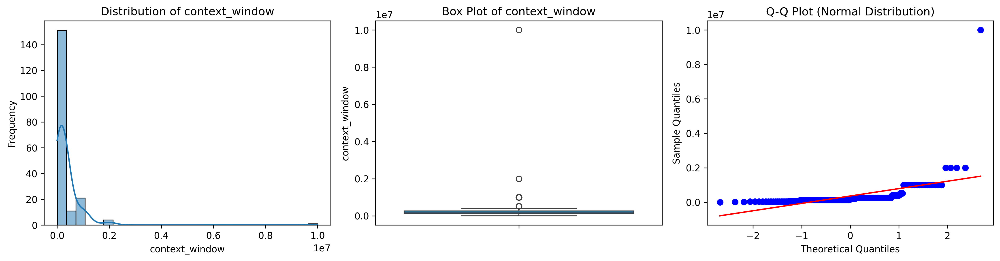
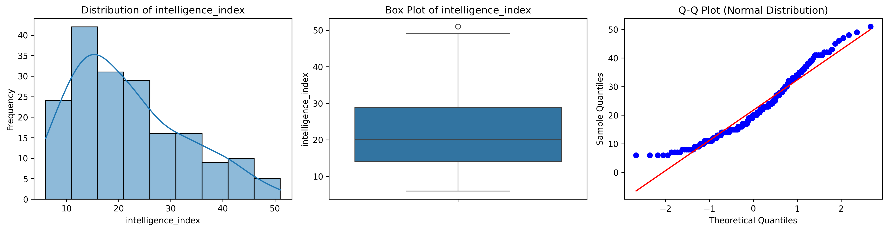
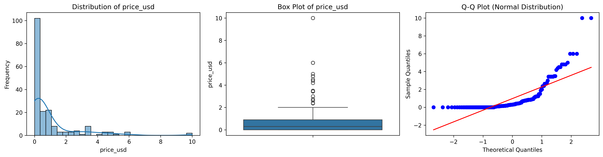

# Data Quality Assessment Report

**Generated:** 2026-01-18 18:26:24
**Dataset:** AI Models Benchmark Dataset 2026
**Source File:** ai_models_enriched.parquet
**Total Rows:** 188
**Total Columns:** 13

---

## Executive Summary

**Overall Quality Score:** 75.0%

This report assesses the data quality across 6 dimensions: Accuracy, Completeness, Consistency, Validity, Integrity, and Timeliness.

**Key Findings:**

- ✓ All numerical values are within expected ranges
- ✓ High data completeness: 96.8%
- ⚠ 34 duplicate model names detected
- ✓ All data values conform to expected formats

**Critical Issues:**

- ⚠ Duplicate models found: 34 duplicates

**Data Readiness for Analysis:**

✓ **Ready for Phase 2: Statistical Analysis** - Data quality meets minimum standards for statistical testing and hypothesis evaluation.

---

## Data Dimensions

### 1. Accuracy

Accuracy measures the extent to which data values are correct and within expected ranges.

**Checks Performed:**
- Intelligence Index in range [0, 100]
- price_usd >= 0
- Speed(median token/s) >= 0
- Latency (First Answer Chunk /s) >= 0
- Context Window >= 0

**Result:** ✓ PASS
**Violations:** 0

**Interpretation:**

✓ All numerical values are within expected business logic ranges. No accuracy issues detected.

---

### 2. Completeness

Completeness measures the extent to which data is complete (no missing values in required fields).

**Total Rows:** 188
**Rows Complete (0 nulls):** 182
**Rows with Any Null:** 6
**Completeness Score:** 96.8%

**Result:** ✓ PASS (threshold: 95%)

**Missing Values by Column:**

| Column | Null Count | Null Percentage |
|--------|------------|-----------------|
| intelligence_index | 6 | 3.19% |
| intelligence_index_valid | 6 | 3.19% |

**Interpretation:**

✓ High data completeness - 96.8% of data is complete.

**Analysis Note:** Missing Intelligence Index values (6 models, 3.19%) represent models without IQ scores, not data quality issues. These models should be filtered out for intelligence-specific analyses (n=182 valid models).

---

### 3. Consistency

Consistency measures the extent to which data is consistent in format, type, and representation.

**Result:** ✗ FAIL

**Checks Performed:**

- Duplicate model names: 34 found
  Examples:
  - {'Model': 'Qwen3 VL 32B', 'count': 2}
  - {'Model': 'Gemini 3 Flash', 'count': 2}
  - {'Model': 'Qwen3 Next 80B A3B', 'count': 2}
  - {'Model': 'Llama 3.3 Nemotron Super 49B', 'count': 2}
  - {'Model': 'NVIDIA Nemotron Nano 12B v2 VL', 'count': 2}
- Unrealistic context windows (>2M tokens): 0
- Creator name inconsistencies (case variations): 0
- Extreme price/intelligence outliers: 0

**Interpretation:**

⚠ 34 duplicate model names detected - review for data entry errors.

---

### 4. Validity

Validity measures the extent to which data values conform to expected formats and value sets.

**Result:** ✓ PASS

**Checks Performed:**
- Creator values in expected set: 0 unexpected values
- Impossible data combinations (speed=0 but latency>0): 0

**Interpretation:**

✓ All data values conform to expected formats and business logic constraints.

---

### 5. Integrity

Integrity measures the extent to which data maintains referential integrity across tables and relationships.

**Result:** N/A - Single table dataset (no foreign key relationships to validate)

**Note:** This dataset is a single flattened table with no joins to external tables. Referential integrity checks are not applicable.

---

### 6. Timeliness

Timeliness measures the extent to which data is current and up-to-date.

**Result:** N/A - Static dataset (no temporal dimension)

**Note:** This is a static benchmark dataset captured at a point in time (2026-01-18). There is no temporal component to assess for freshness.

---

## Distribution Analysis

This section summarizes distribution statistics for all numerical variables, including skewness, kurtosis, and normality test results.

| Column | Count | Mean | Std | Median | Min | Max | Skewness | Kurtosis | Normal? |
|--------|-------|------|-----|--------|-----|-----|----------|----------|---------|
| context_window | 188 | 359898.94 | 797142.08 | 200000.00 | 4000.00 | 10000000.00 | 9.63 | 114.20 | No |
| intelligence_index | 182 | 21.73 | 10.73 | 20.00 | 6.00 | 51.00 | 0.67 | 2.63 | No |
| price_usd | 188 | 0.97 | 1.64 | 0.30 | 0.00 | 10.00 | 2.82 | 12.58 | No |
| Speed(median token/s) | 188 | 89.77 | 92.27 | 72.00 | 0.00 | 550.00 | 1.73 | 7.38 | No |
| Latency (First Answer Chunk /s) | 188 | 3.31 | 12.68 | 0.52 | 0.00 | 113.01 | 7.11 | 58.73 | No |

**Visualizations:**

- **context_window**: 
- **intelligence_index**: 
- **price_usd**: 
- **Speed(median token/s)**: 
- **Latency (First Answer Chunk /s)**: 

**Distribution Interpretation:**

**context_window:**
- Skewness: 9.63 - right-skewed (tail extends toward higher values)
- Kurtosis: 114.20 - heavy-tailed (more outliers than normal distribution)
- Normality: Not normally distributed (p < 0.05)

**intelligence_index:**
- Skewness: 0.67 - right-skewed (tail extends toward higher values)
- Kurtosis: 2.63 - light-tailed (fewer outliers than normal distribution)
- Normality: Not normally distributed (p < 0.05)

**price_usd:**
- Skewness: 2.82 - right-skewed (tail extends toward higher values)
- Kurtosis: 12.58 - heavy-tailed (more outliers than normal distribution)
- Normality: Not normally distributed (p < 0.05)

**Speed(median token/s):**
- Skewness: 1.73 - right-skewed (tail extends toward higher values)
- Kurtosis: 7.38 - heavy-tailed (more outliers than normal distribution)
- Normality: Not normally distributed (p < 0.05)

**Latency (First Answer Chunk /s):**
- Skewness: 7.11 - right-skewed (tail extends toward higher values)
- Kurtosis: 58.73 - heavy-tailed (more outliers than normal distribution)
- Normality: Not normally distributed (p < 0.05)

**Implications for Statistical Analysis:**

⚠ All numerical variables are non-normally distributed. Non-parametric statistical methods (e.g., Spearman correlation, Mann-Whitney U test) are recommended over parametric tests (e.g., Pearson correlation, t-test).

---

## Outlier Analysis

- **Detection Method:** Isolation Forest (contamination=5%, random_state=42)
- **Outliers Detected:** 10 models (5.32%)
- **Inliers:** 178 models (94.68%)

**Outlier Examples (Top 10 by anomaly score):**

| Model | Creator | Price | Intelligence | Speed | Latency | Outlier Score |
|-------|---------|-------|--------------|-------|---------|---------------|
| GPT-5 mini (high) | OpenAI | $0.69 | 41 | 72.0 | 113.01 | -0.656 |
| GPT-5 nano (high) | OpenAI | $0.14 | 27 | 119.0 | 111.22 | -0.651 |
| Llama 4 Scout | Meta | $0.28 | 14 | 117.0 | 0.42 | -0.644 |
| GPT-5.2 (xhigh) | OpenAI | $4.81 | 51 | 100.0 | 44.29 | -0.634 |
| Claude Opus 4.5 | Anthropic | $10.00 | 49 | 79.0 | 1.70 | -0.606 |
| Gemini 3 Pro Preview (high) | Google | $4.50 | 48 | 128.0 | 32.19 | -0.599 |
| Gemini 2.5 Flash-Lite (Sep) | Google | $0.17 | 22 | 550.0 | 4.22 | -0.597 |
| Claude Opus 4.5 | Anthropic | $10.00 | 43 | 72.0 | 1.96 | -0.589 |
| Gemini 2.5 Pro | Google | $3.44 | 34 | 160.0 | 32.99 | -0.585 |
| GPT-5.1 (high) | OpenAI | $3.44 | 47 | 127.0 | 26.50 | -0.553 |

**Outlier Interpretation:**

⚠ 10 models (5.32%) flagged as multivariate outliers based on price, speed, latency, and intelligence index.

**Recommendations:**
- Outliers are preserved in the dataset (per STATE.md decision) for domain expert review
- Consider analyzing models with and without outliers to assess impact on conclusions
- Outliers may represent legitimate high-performance models (e.g., GPT-5.2, Claude Opus 4.5) rather than data errors
- For correlation analysis, consider computing metrics with and without outliers to assess robustness

---

## Sanity Check Results

Summary of all sanity check results across 4 quality dimensions:

| Dimension | Status | Score | Details |
|-----------|--------|-------|---------|
| Accuracy | ✓ PASS | 100% | 0 violations |
| Completeness | ✓ PASS | 96.8% | 6 rows with nulls |
| Consistency | ✗ FAIL | 0% | 34 duplicates |
| Validity | ✓ PASS | 100% | 0 impossible combinations |

**Dimensions Passed:** 3/4
**Dimensions Failed:** 1/4
**Overall Quality Score:** 75.0%

---

## Data Quality Issues Found

Summary of all data quality issues discovered during the pipeline:

| Issue | Severity | Count | Recommendation |
|-------|----------|-------|----------------|
| Missing values | Info | 6 | Filter for intelligence-specific analyses (n=182) |
| Duplicate models | Critical | 34 | Review for data entry errors |

---

## Next Steps

### Readiness for Phase 2: Statistical Analysis

✓ **READY FOR PHASE 2** - Data quality meets minimum standards for statistical analysis.

**Known Limitations to Consider:**

- 6 models lack intelligence_index scores - filter to n=182 for intelligence-specific analyses
- All numerical variables are right-skewed - non-parametric methods recommended
- Context Window has extreme skewness (9.63) - log transformation may be appropriate
- 10 models flagged as outliers (5.32%) - assess impact on correlation analysis
- External data enrichment failed (0% coverage) - temporal analysis not possible
- Model tier classification: 67.6% unknown - limits tier-based analysis power

**Recommended Preprocessing for Specific Analyses:**

**Correlation Analysis:**
- Use Spearman rank correlation (non-parametric, robust to skewness)
- Consider log-transformation for Context Window (extreme skewness: 9.63)
- Compute correlations with and without outliers to assess robustness

**Hypothesis Testing:**
- Use Mann-Whitney U test or Kruskal-Wallis test (non-parametric alternatives to t-test/ANOVA)
- Filter to n=182 models for intelligence-specific tests (exclude null IQ scores)

**Distribution Analysis:**
- All variables are non-normally distributed - avoid parametric tests assuming normality
- Consider median and IQR for descriptive statistics (robust to outliers)
- Use bootstrap methods for confidence intervals if needed

**Phase 2 Starting Points:**
- Dataset: data/processed/ai_models_enriched.parquet (188 models, 16 columns)
- Derived metrics available: price_per_intelligence_point, speed_intelligence_ratio, model_tier, log_context_window
- Distribution plots: reports/figures/ (5 numerical variables)

---

## Metadata

**Generation Timestamp:** 2026-01-18 18:26:24
**Pipeline Version:** Phase 1 - Data Pipeline & Quality Assessment
**Plan:** 01-06 (Quality Report Generation)

**Dependencies:**
- polars >= 1.0.0
- scipy >= 1.15.0
- scikit-learn >= 1.6.0
- matplotlib >= 3.10.0
- seaborn >= 0.13.0

**Data Sources:**
- Raw data: ai_models_performance.csv (Kaggle AI Models Benchmark Dataset 2026)
- Processed data: data/processed/ai_models_enriched.parquet
- Distribution statistics: src.analyze.analyze_distribution()

**Quality Dimensions Assessed:**
1. Accuracy - Range and constraint validation
2. Completeness - Missing value analysis
3. Consistency - Duplicate and format checking
4. Validity - Schema and business logic validation
5. Integrity - Referential integrity (N/A - single table)
6. Timeliness - Data freshness (N/A - static dataset)

*End of Report*